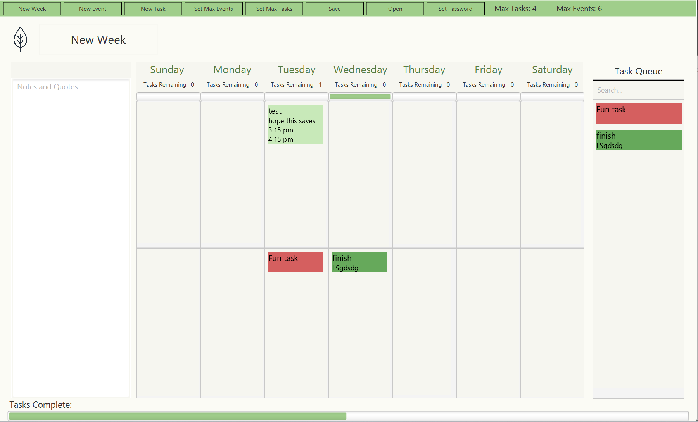
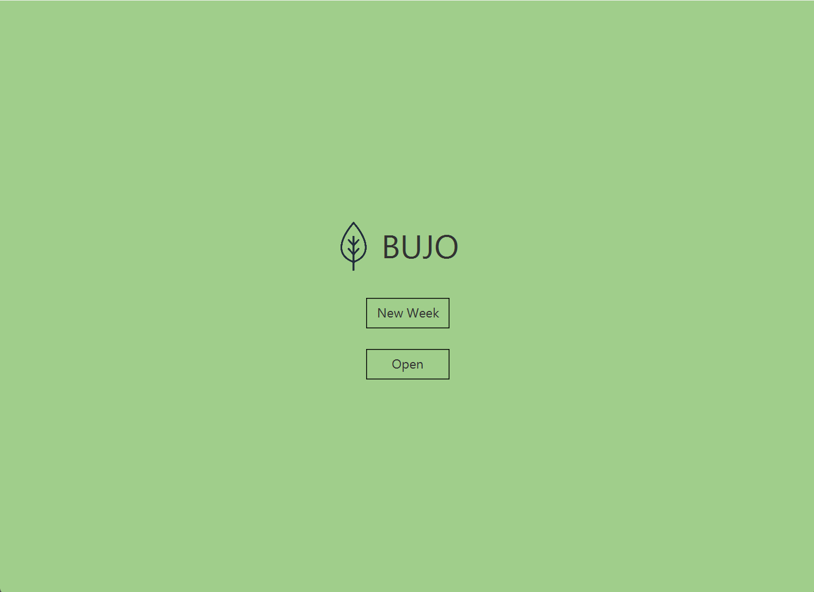
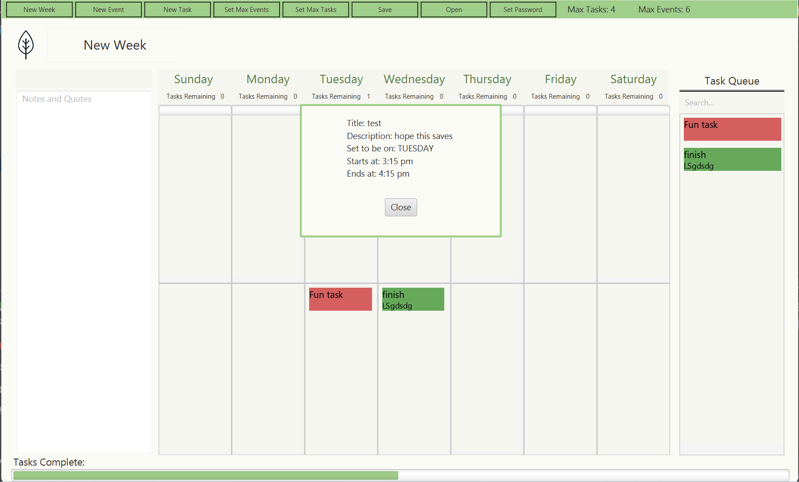

# 3500 PA05 Project Repo

[PA Write Up](https://markefontenot.notion.site/PA-05-8263d28a81a7473d8372c6579abd6481)

Pitch: 
Ever wish you had something to document all of your plans and events. I bet your grandma has given you a physical 
planner for this exact problem. We all know we never update that planner after one week. Instead, we have made an app 
that can do all the things a planner can do and more. With this java journal you can document all of your task for the 
week down to what day you need to do each task. You can also make them complete and see how far along you are for each 
day and the week using the progress bar. Have some events coming up and don't want to miss it? Mark you events with the 
name, time, and description. Along with being able to document everything save your progress and open it any time you 
want. Another thing a physical journal can't do that we can is password protection in case you have sensitive info or 
just don't want you sibling going through your stuff when they borrow your computer. With the java journal stay on top 
of your life and never miss a beat.

Some cool extra features include shortcuts like:
ctrl s: to save
ctrl e: to create new event
ctrl t: to create a new task
ctrl p: to set a new password
ctrl o: to open a new bujo file
ctrl n: to create a new week
ctrl shift e: to set a new max events
ctrl shift t: to set a new max task

Screenshot:
main gui

splash screen

mini view

SOLID Principles:

S:
For the single responsibility principle we have a controller which does a specific task. Withing each of these 
controllers the methods have one purpose with helper methods to accomplish the task that is needed.
A great example of the single responsibility is our Event and Task controllers these controllers are only meant to deal 
with when a new event or task is being made and that is exactly what it does.

O:
For the open closed principle only the methods that need to be public are public. Most controller classes only have one 
or two public methods. As well as privatising most things are of our classes are final since there isn't a need to 
extend them. If they needed to be changed we would need to change the actual code. This means someone else can't have 
our code and just extend something and completely ruin the functionality. However, our code is open to expansion since 
we used interfaces fxml it is easy to build on top of that framework. Also, a great method that could be used for 
expansion is the showPopup method this allows for many messages to be easily shown without having to code much.

L:
For the Liskov sub principle we extended VBox, but we didn't override methods in VBox and drastically change their 
meaning or return an incompatible type like a subtype. This principle is being followed when it comes to the Task and 
Events as these classes extend VBox.

I:
In our project we didn't have any god interfaces that do everything. Since we avoid that and the only interface we 
have is for type purposes. We did not violate this principle and the interface we have has one job of making 
controllers a certain type and that's it.

D:
For this principle we did something not commonly associated with this principle and used java FXML for the frame of our 
GUI. This was done so classes that need a specific layout for the GUI doesn't rely on a class we created that can be 
screwed around with. Our classes depend on the FXML which is a higher level abstraction of format then having a class 
to make the format for our format.

Images used:

Jar:
[Jar](JavaJournal.jar)
